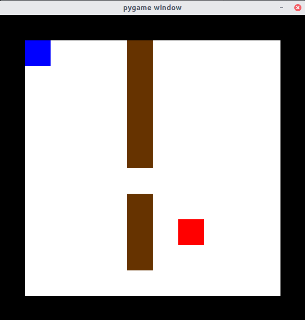
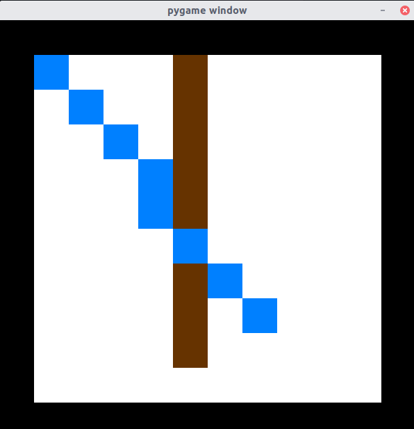

# The Project for Artifical Intelligence Course Assignment

## Python package requirement

- tensorflow
- tensorflow-probability
- pygame
- numpy

## A\*

### Game Rule

#### Color Meaning

- white cell means space
- brown cell means wall
- blue cell means start point
- red cell means end point
- blue path

#### Operation

- **Please enter space to find the shortest path**

### Game Screen Shot

#### Start Picture

#### End Picture

## Bayesian Method

I use Tensorflow Probability module to predict the amount of books each day for reader based on aritifical data

Please use **jupyter notebook** to reproduce the result or you can just watch html file
